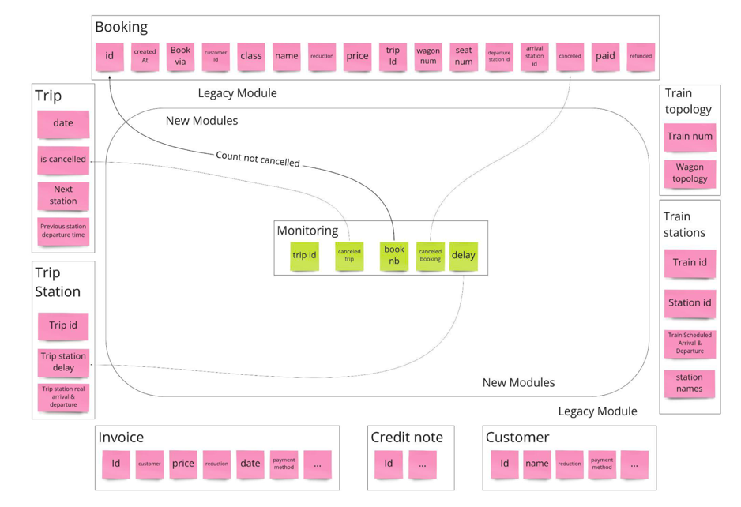
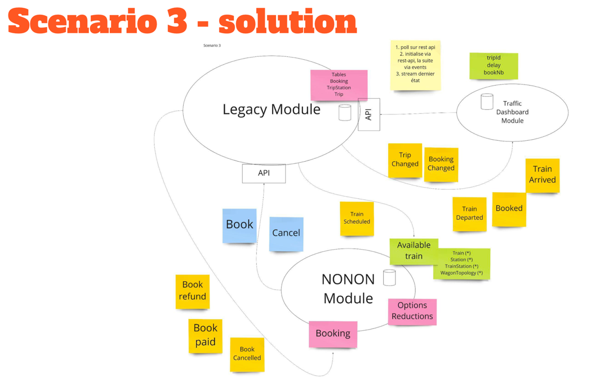

# Lab : Decoupe mon monolith

[Lien de la pres](./splitmymonolith-devoxx-220422110755.pdf)

On attaque par le schema de base de données.
On retravaille le modèle en découpant les tables de manière plus claire. Plus representative du métier.  

Attention à ne pas tomber dans le piège de monolith distribuer.  
Cela amène des problématiques réseau, livre sur ça dans les sources.  

## Premier atelier

On part du schéma actuel, découpage des grosses tables en table plus business.  
=> Table trip  
=> Table Booking  

Il n'y a pas qu'une solution possible.

### Différentes approches / patterns

**Bubble context**  
Upstream / Downstream

**Autonomous bubble - synchronous**  
Il est autonome, il a sa propre BDD.

**Autonomous bubble - state stream**  
Basé sur des évents.

**Autonomous bubble - notif stream**  
Basé sur des évents.

**Exposing legacy assets as services**  
Quand l'ancien modèle a besoin des mouvements, on expose des APIs pour faire ça.

## Atelier 2

### intro

Choix des patterns.

Solution qu'ils ont choisi :   
On tape sur la base de données toutes les minutes, on met ces infos dans un cache.
(Legacy (BDD)) << (pull each minute) << ((in memory) Trafic dashboard module)  
Pas besoin de toucher l'existant.  

### Atelier

Donc là sur cet atelier en fonction des différents patterns on brainstorm sur la solution qui nous parrait la plus appropriée à la problématique.  

**Notre solution** :  

Transaction sur les bases de données, push des events dans un system de messagerie (rabbit, kafka)  
Le module de refonte consomme le systeme de messagerie, ACL ? 

**Solution** :

Evenements, pour avoir le temps réel, le legacy pousse l'événement, on va devoir mettre des sondes pour pousser l'événements pour minimiser l'impact sur le legacy.  
On a après une API pour récupérer l'état courant du systeme. (le nouveau module call le legacy GET).

## Atelier 3

Data, new point of view.  
Comment on agreg ? Qu'est ce qui est nécessaire dans le modèle downstream ? Qu'est ce qui est nécessaire dans le modèle upstream ?

### Atelier 4

On veut rajouter des options sur les bookings, comment on fait ?  
Il faut chercher à faire évoluer notre architecture

Strangler fig pattern. Petit à petit on renforce le legacy jusqu'à ce qu'il disparaisse.

### Sources 

[Getting started with DDD](https://www.youtube.com/watch?v=ZbnF0Dn6dAA)

